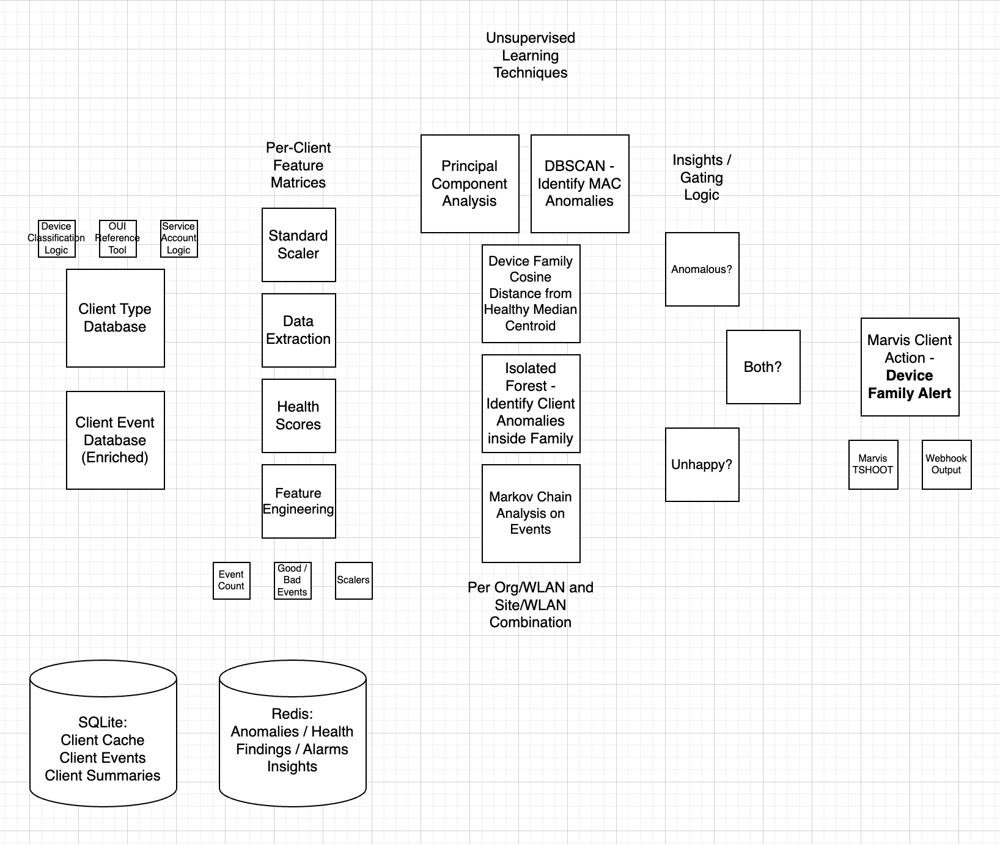

# Project Sasquatch — Client Anomaly Detection



Client family anomaly detection for Juniper Mist wireless networks. Detects device misbehavior that aggregate metrics miss — clients stuck in DHCP loops, stale PMKIDs causing roam failures, issues with specific chipsets, device families with poor DNS performance, etc. Leverages multiple ML techniques on client event datalakes that have been enriched with device fingerprinting information.

> **New to Sasquatch?** Start with the admin guide — [GUIDE_Unsupervised_Anomaly_Detection.pdf](GUIDE_Unsupervised_Anomaly_Detection.pdf). It walks through every view in the dashboard, the alert / finding lifecycle, and the Config panel knobs in plain language. This README is the operator / developer reference for deploying and extending the platform.

---

## How It Works

On a configurable interval (default: 60 minutes), Sasquatch:

1. Pulls client events from the Mist org events endpoint — a manual "Collect Events" full pull fetches the trailing 12 hours; the hourly poll tops up the trailing 1 hour. Events are streamed to SQLite and enriched with device metadata at write time.
2. Builds per-MAC behavioral feature vectors — normalized event-type frequencies, so volume is never the signal.
3. Runs a four-stage ML pipeline:
   - **DBSCAN** across all MACs in the WLAN scope (population-wide behavioral outliers)
   - **Family Centroid cosine distance** across device-family centroids, measured against a healthy-family reference centroid (entire families behaving differently from the healthy baseline)
   - **Per-family Isolation Forest** within each device type (individual devices anomalous relative to their family peers)
   - **Markov Chain** episode analysis + stuck-loop detector — scores event-transition sequences against a 24hr site baseline and flags devices caught in a failure loop (e.g. `AUTH_FAILURE → DEAUTHENTICATION`)
4. Computes a **separate** per-family health score from failure ratios — independent of anomaly detection.
5. Fires a webhook only when a family passes the composite alarm gate (see [Alert Logic](#alert-logic)).

Results are stored in SQLite + Redis and served through a React dashboard with org-wide and per-site views.

**No data egresses to third-party AI providers.** Detection is pure ML + rule-based.

---

## Architecture

```
Mist API
  ├── client_cache.py       (daily)       ─→ SQLite clients table
  └── event_collector.py    (hourly poll) ─→ SQLite events table (enriched)

                    feature_engineer.py
                          ↓
             Redis: per-MAC feature vectors

                    anomaly_detector.py
                (DBSCAN → Family Centroid → Per-family IF → Markov)
                          ↓
              Redis: anomaly scores + findings
                          ↓
                   health_scorer.py
                          ↓
              Redis: per-family health

          webhook_dispatcher.py (composite gate)
          ├── POST webhook (if eligible)
          └── FastAPI routes → React dashboard
```

| Layer | Technology |
|---|---|
| Backend | FastAPI + APScheduler (Python) |
| Frontend | React + Vite, served by nginx |
| System of record | SQLite via aiosqlite (events, clients, client_summary) |
| Derived cache | Redis 7+ (features, anomalies, findings, summary cache, locks) |
| ML | scikit-learn — IsolationForest, DBSCAN, PCA, NearestNeighbors |
| Feature Engineering | pandas, numpy |
| Mist API Client | httpx (async) |
| Orchestration | Docker Compose |

---

## Prerequisites

- Docker Engine 24+ with Compose v2
- Juniper Mist API token + org ID

Nothing else is required on the host — Python, Node, and Redis all run inside containers.

---

## Quick Start

```bash
cd unsupervised_anomaly

# 1. Bootstrap .env from the template
cp .env.example .env

# 2. Fill in Mist credentials. Without these, the dashboard loads but
#    "Collect Events" will fail — there is no sample-data / demo mode.
$EDITOR .env        # set MIST_API_TOKEN, MIST_ORG_ID, MIST_CLOUD_HOST

# 3. Build and start everything (Redis, backend on :8000, frontend on :3000)
docker compose up -d --build
```

Open [http://localhost:3000](http://localhost:3000).

Useful commands:

```bash
docker compose logs -f backend        # tail backend logs
docker compose logs -f frontend       # tail nginx / static-serve logs
docker compose restart backend        # restart backend only
docker compose up -d --build backend  # rebuild after code changes
docker compose down                   # stop everything (volumes preserved)
docker compose down -v                # stop and wipe SQLite + Redis volumes
```

**LAN access:** the frontend is built inside the Docker image, so its `VITE_API_BASE_URL` is baked in at build time. To point the dashboard at a backend reachable on your LAN, drop an override into the gitignored `sasquatch/frontend/.env.production.local` before building:

```bash
echo 'VITE_API_BASE_URL=http://192.0.2.10:8000' > sasquatch/frontend/.env.production.local
docker compose up -d --build frontend
```

Persistent state lives in named Docker volumes:

| Volume | Contents |
|---|---|
| `unsupervised_anomaly_sqlite-data` | `sasquatch.db` — events, clients, client_summary |
| `unsupervised_anomaly_redis-data`  | Redis RDB/AOF snapshots |
| `unsupervised_anomaly_logs`        | Backend log files |

---

## Configuration

Copy `.env.example` to `.env`. Most operational and ML tuning parameters are configured through the dashboard toolbar (General Config, Anomaly Config, and Webhook Config panels) and persisted automatically to `sasquatch/client_anomaly/config_overrides.json` — no `.env` edit required after first launch.

The variables below are those that must be set in `.env` before starting.

### Mist API

| Variable | Description |
|---|---|
| `MIST_API_TOKEN` | Mist API token with read access to client events |
| `MIST_CLOUD_HOST` | Regional API host — `api.mist.com`, `api.gc1.mist.com`, `api.gc4.mist.com`, `api.eu.mist.com`, etc. Do **not** include `/api/v1`. |
| `MIST_ORG_ID` | UUID of the org — required. Per-site collection (`MIST_SITE_ID`) has been retired; every site in the org is discovered and scored automatically. |

### Frontend

| Variable | Default | Description |
|---|---|---|
| `VITE_API_BASE_URL` | `http://localhost:8000` | Backend URL used by the React frontend at build time. Set via `sasquatch/frontend/.env.production.local` and rebuild the frontend container. |

### Advanced ML Constants

These variables have no GUI equivalent. Most deployments will not need to change them from their defaults.

| Variable | Default | Description |
|---|---|---|
| `ANOMALY_IF_N_ESTIMATORS` | `100` | Number of trees in every IsolationForest. More trees = more stable scores at diminishing returns. Increase to 200–500 if scores are noisy across consecutive cycles. |
| `ANOMALY_RANDOM_STATE` | `42` | Global random seed for all ML components. Fixed integer gives reproducible scores across cycles. Set to `-1` to use a random seed each run. |
| `ANOMALY_DBSCAN_PCA_VARIANCE` | `0.95` | Fraction of variance PCA must retain when reducing dimensions before DBSCAN. DBSCAN consumes the ~15-dim category vector; PCA typically collapses it to a handful of components at 0.95. Does not affect IsolationForest or the family centroid distance pass — both consume the ~59-dim event vector directly. |
| `ANOMALY_CENTROID_DIST_THRESHOLD` | `0.35` | Cosine distance (L2-normalized unit vectors) above which a family centroid is flagged as `is_family_outlier`. |
| `ANOMALY_CENTROID_HEALTHY_REF_THRESHOLD` | `0.75` | Families below this health score are excluded from the centroid reference pool. |
| `ANOMALY_RSSI_MIN_THRESHOLD` | `-87` | Drop events with RSSI below this floor (dBm), regardless of type. Set to `-120` to disable. |
| `MARKOV_STUCK_LOOP_THRESHOLD` | `0.4` | Fraction of transitions dominated by one failure pair to flag stuck-loop. |
| `MARKOV_STUCK_LOOP_MIN_EVENTS` | `20` | Minimum events before stuck-loop detection runs. |

See `sasquatch/client_anomaly/config.py` for the full DEFAULTS map.

---

## Feature Design

Each MAC carries TWO feature vectors. Both are probability distributions over Mist events; volume is never a signal. Different stages need different granularity, so each vector is routed to the consumers it fits.

**`event_vector` — ~59-dim per-event-type frequency distribution**
One dimension per known Mist client event type (DHCP, DNS, auth, roam, ARP, disassoc, etc.). Value = `count(event_type) / total_events` for that MAC. Fed to **Isolation Forest** (per-family intra-family outliers) and the **Family Centroid cosine-distance** detector (inter-family outliers). Granular enough to distinguish, e.g., two iPhones failing at different roam types (`MARVIS_EVENT_CLIENT_FBT_FAILURE` vs `MARVIS_EVENT_CLIENT_AUTH_FAILURE_OKC`) — exactly the per-revision fingerprint the detector exists to find.

**`category_vector` — ~15-dim semantic-bucket frequency + concentration**
~13 dimensions: one per `EVENT_CATEGORIES` bucket (DHCP_SUCCESS, ROAM_FAILURE, etc., excluding COLLABORATION). Plus `top_category_fraction` and `top_failure_category_fraction` to amplify single-category-loop signal. Fed to **DBSCAN** (population-wide clustering, after PCA — semantic distance is the right level for whole-population grouping), the **health scorer** (success/failure ratios are inherently category-level), the **top-contributing-features explainer** (chip labels need readable category names), and the **MacDrilldown chart** (~15 readable bars beat 59 sparse ones).

**Two-tier per-MAC event-count threshold:** `feature_min_mac_events` (default 3) is the floor for entering the feature pool at all — the Health scorer and inter-family Centroid detector consume the full pool. `anomaly_min_mac_events` (default 10) is applied inside the IF and DBSCAN passes at scoring time, since per-MAC vectors below that are too sparse for reliable distance-based scoring. Both thresholds are exposed in the General Config panel.

**Post-hoc explainer features** (computed only after a MAC is flagged, never fed to ML):
PMKID failure ratio, DHCP XID counts, roam failure types — used to generate human-readable `probable_pattern` labels like `pmkid_stale`, `dhcp_discard_loop`, `auth_failure_terminal`.

---

## Alert Logic

Webhooks fire only when **all three** gates pass for a device family:

1. **Anomaly gate** — the family qualifies via **either**:
   - `is_family_outlier` — the inter-family centroid detector flagged the whole family as behaviorally different from the healthy reference. **Independently sufficient** — bypasses the rollup ratio.
   - **OR** the DBSCAN-or-Markov rollup ratio: the per-MAC union of `is_dbscan_outlier` and `is_markov_outlier` reaches `ALARM_DBSCAN_MARKOV_RATIO` (default 0.70) of `total_mac_count`. A single client flagged by both detectors counts once.
2. **Health gate** — family `health_score < ANOMALY_HEALTH_SCORE_THRESHOLD` (default 0.20) **OR** the service-alarm device-percentage gate fires (`ALARM_SERVICE_DEVICE_PCT`, default 0.70, of the family's MACs have individually tripped a service alarm).
3. **Family-size gate** — `total_mac_count >= ALARM_MIN_FAMILY_SIZE` (default 10). Findings below the floor still appear in the UI; only the webhook + org/site alert feeds suppress them.

All four gate knobs live under the **General Config** panel in the GUI and take effect on the next detection cycle. Finding severity (`minimal` / `moderate` / `significant`) is informational only — it is displayed in the UI but does not gate webhook dispatch.

### Marvis TSHOOT Enrichment

Before posting the webhook, Sasquatch calls the Mist Marvis TSHOOT API for the three worst-health MACs in each qualifying finding. All TSHOOT calls are issued concurrently. Results are attached to the finding payload as `marvis_tshoot`:

```json
"marvis_tshoot": [
  {
    "mac": "aabbccddee01",
    "tshoot_results": [
      {
        "category": "Client",
        "reason": "Failed Fast Roam",
        "text": "The client failed fast roam 25% of the time...",
        "site_id": "12f333fe-..."
      },
      {
        "category": "Connectivity",
        "reason": "Poor Coverage",
        "text": "Due to the device connecting at a low signal strength.",
        "recommendation": "1. Ensure sufficient AP coverage. 2. Check for sticky client behavior.",
        "site_id": "12f333fe-..."
      }
    ]
  }
]
```

TSHOOT failures for individual MACs return an empty `tshoot_results` list without blocking the webhook. The field is omitted entirely if `MIST_ORG_ID` or `MIST_API_TOKEN` are not set.

---

## Dashboard

| View | Description |
|---|---|
| **Site WLAN Family Insights** | Heatmap of device families × event categories. Anomaly badges + health bar per row. Auto-refreshes every 60s. |
| **Findings Feed** | Three-section layout per site: ALERT → HEALTH → ANOMALOUS. |
| **Org Overview** | Four-tab shell: Org Alerts (default), Org Overview, Org Family Insights, Findings. |
| **Org Alerts** | Org-wide alerts grouped by family; site alerts grouped by site. Default org view. |
| **Org Family Insights** | Heatmap aggregated across all org sites with mac_count-weighted health. |
| **Family Drilldown** | Per-MAC breakdown for a device family at a site or across the org, plus MAC-prefix search. |
| **MAC Drilldown** | 24hr event timeline + feature vector vs family baseline + IF score + DBSCAN label + Markov episode stats. |

---

## API Endpoints

All reads come from SQLite + Redis — no real-time Mist API calls in the request path.

```
GET  /api/v1/sites/{site_id}/findings
GET  /api/v1/sites/{site_id}/health
GET  /api/v1/sites/{site_id}/events/summary
GET  /api/v1/sites/{site_id}/anomalies/{mac}
GET  /api/v1/sites/{site_id}/families/{family}/if-outliers
GET  /api/v1/org/sites
GET  /api/v1/org/summary
GET  /api/v1/org/alerts
GET  /api/v1/org/alerts-full
GET  /api/v1/org/alert-history
GET  /api/v1/org/findings
GET  /api/v1/org/family-insights
GET  /api/v1/org/families/{family}/drilldown
GET  /api/v1/org/families/search-drilldown
GET  /api/v1/org/clients/search
GET  /api/v1/org/clients/search-drilldown
GET  /api/v1/org/clients/export.csv
POST /api/v1/org/refresh              # trigger daily client-cache refresh
POST /api/v1/org/collect-full         # trailing-12hr event collect
POST /api/v1/org/collect-events-only  # events-only collect (reuse existing client cache)
POST /api/v1/org/detect               # re-run the detection pipeline
POST /api/v1/org/flush                # drop cached aggregates
GET  /api/v1/org/polling              # hourly-poll flag
POST /api/v1/org/polling              # toggle hourly-poll flag
GET  /api/v1/org/auto-detect          # auto-detect flag
POST /api/v1/org/auto-detect          # toggle auto-detect flag
```

Full route inventory in the auto-generated Swagger UI at `http://localhost:8000/docs`.

---

## Storage Layout

Events and the org-wide client cache live in **SQLite** (system of record, survives Redis flushes). Derived state lives in **Redis** with TTLs so loss just triggers a recompute.

### SQLite

Inside the backend container: `/unsupervised_anomaly/sqlite/sasquatch.db` (mounted from the `sqlite-data` named volume).

| Table | Retention | Contents |
|---|---|---|
| `events` | 7 days | Every client event, enriched with device metadata at write time. Purged daily at 03:00. |
| `clients` | until next refresh | Org-scoped `MAC → {family, model, os, manufacturer, last_site_id, last_username, …}`. Overwritten in place by the daily client-cache refresh. |
| `client_summary` | rebuilt per cycle | Materialized per-(mac, site_id, wlan) rollup backing the drilldown endpoints. |
| `client_refresh_log` | permanent | One row per org recording the last cache-refresh timestamp. |

### Redis

| Key | TTL | Contents |
|---|---|---|
| `sasquatch:event_type_index` | 7 days | Ordered list of known Mist client event types (from `GET /api/v1/const/client_events`). |
| `sasquatch:features:{site_id}:{wlan}` | 24 hr | Per-MAC feature vectors (`event_vector` + `category_vector`). |
| `sasquatch:anomalies:{site_id}:{wlan}` | 24 hr | Per-MAC anomaly scores + outlier flags. |
| `sasquatch:health:{site_id}:{wlan}` | 24 hr | Per-family health scores + per-category breakdown. |
| `sasquatch:findings:{site_id}:{wlan}` | 24 hr | Rolled-up per-family findings. |
| `sasquatch:org_anomalies:{site_id}:{wlan}` | 24 hr | Per-MAC org-wide scores from `score_org_wide`. |
| `sasquatch:org_findings:{wlan}` | 24 hr | Cross-site findings (one entry per family across all sites). |
| `sasquatch:markov_baseline:{site_id}:{wlan}` | 48 hr | Markov transition matrix + event-type index. |
| `sasquatch:summary:*` | 2 hr | Pre-computed dashboard aggregates (org/site overview, alerts, findings). Rebuilt at the tail of every detection cycle. |
| `sasquatch:alert_active:{site_id}:{wlan}` | explicit | Currently-open alert sessions by family. |
| `sasquatch:alert_session:{key}` | 8 days | Individual alert session records (for history API). |
| `sasquatch:lock:global_operation` | 6 hr | Global mutex — only one collect/detect runs at a time. |

Detection runs independently for each unique SSID — there is no combined cross-WLAN scope. All API endpoints require an explicit `?wlan=` parameter.

---

## Project Structure

```
unsupervised_anomaly/
├── sasquatch/
│   ├── client_anomaly/
│   │   ├── config.py                 # DEFAULTS + config_overrides.json resolver
│   │   ├── db.py                     # Async SQLite layer + migrations
│   │   ├── client_cache.py           # Daily org-wide MAC → device metadata refresh
│   │   ├── event_collector.py        # Streaming org event pull + enrichment → SQLite
│   │   ├── feature_engineer.py       # Per-MAC behavioral feature vectors
│   │   ├── anomaly_detector.py       # Four-stage ML pipeline + finding rollup
│   │   ├── markov_analyzer.py        # Markov Chain episode + stuck-loop analysis
│   │   ├── health_scorer.py          # Per-family failure rate scoring (independent)
│   │   ├── webhook_dispatcher.py     # Composite-gate alert dispatch + TSHOOT enrichment
│   │   ├── alert_tracker.py          # Persistent alert-session history
│   │   ├── client_summary_builder.py # Materialized per-(mac, site, wlan) rollup
│   │   ├── summary_cache.py          # Pre-computed dashboard aggregates
│   │   ├── scheduler.py              # APScheduler jobs + global mutex
│   │   ├── oui_lookup.py             # Local IEEE OUI database (no network calls)
│   │   └── api/
│   │       └── routes.py             # FastAPI route definitions
│   ├── frontend/
│   │   └── src/
│   │       ├── App.jsx
│   │       ├── api.js
│   │       └── components/
│   │           ├── SiteOverview.jsx
│   │           ├── FindingsFeed.jsx
│   │           ├── OrgOverview.jsx
│   │           ├── OrgAlerts.jsx
│   │           ├── OrgFindingsFeed.jsx
│   │           ├── OrgFamilyInsights.jsx
│   │           ├── MacDrilldown.jsx
│   │           ├── FamilyDrilldown.jsx
│   │           ├── OrgFamilyDrilldown.jsx
│   │           ├── ClusterViz.jsx
│   │           ├── OrgClusterViz.jsx
│   │           ├── ColumnSelector.jsx
│   │           └── familyColors.js
│   └── main.py
├── Dockerfile                  # Backend image
├── Dockerfile.frontend         # Frontend image (Vite build → nginx)
├── docker-compose.yml
├── nginx.conf
├── redis.conf
├── requirements.txt
└── .env.example
```

---

## Known Issues

See [TODO.md](TODO.md) for the tracked backlog.

---

## Security Notes

- Data never egresses to third-party LLM providers. All ML is local.
- The API has no built-in authentication. Put it behind a reverse proxy with TLS and access control in production.
- Redis has no auth by default — bind to localhost or use `requirepass` in production.
- CORS defaults to `localhost:3000` / `localhost:5173`. Override via `SASQUATCH_CORS_ORIGINS` in `.env` if you expose the dashboard on a LAN IP.
